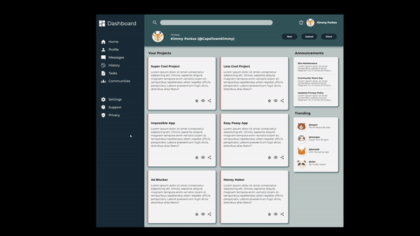

# Admin Dashboard
Dynamic layout with CSS Grid, a project from The Odin Projects Full Stack Engineering Course.

Best viewed with Chrome.

### The Project Objectives:
* Build an Admin Dashboard using CSS Grid and Flexbox.
* Use Git version control.
* Use command line.
* Develop locally on your computer.

___

---
## Software & Skills:

* 
* 
* 
* 
* 
* 

#

###### Badges from **Simply Badges** 